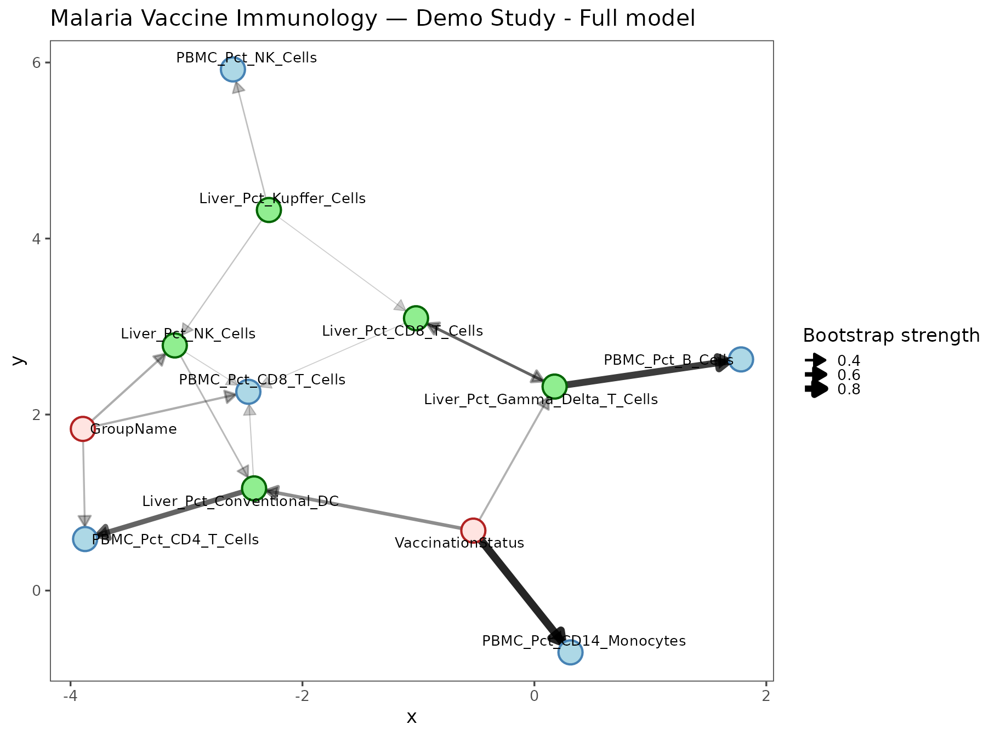
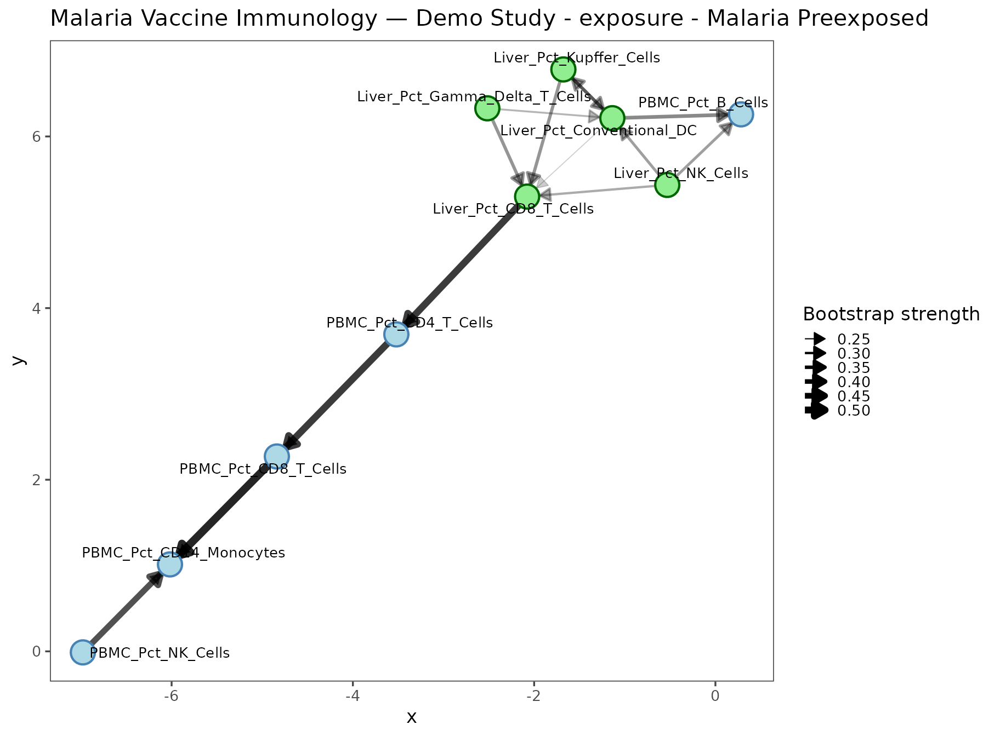
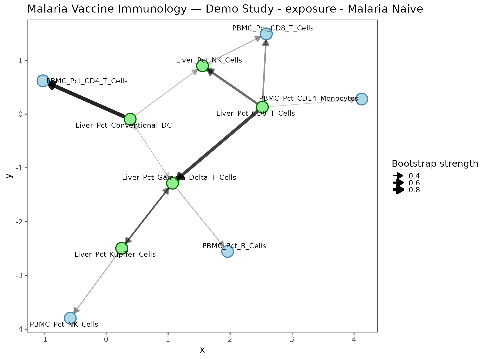
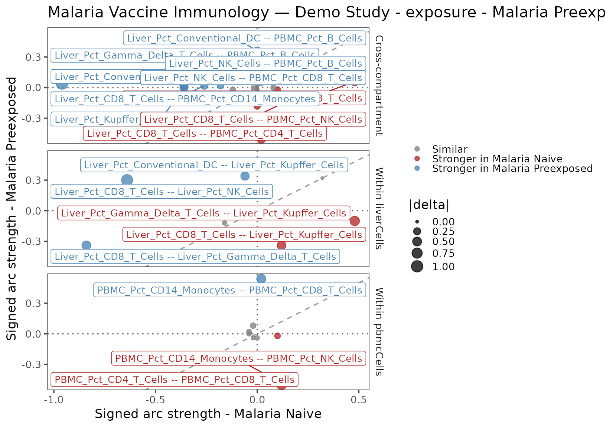
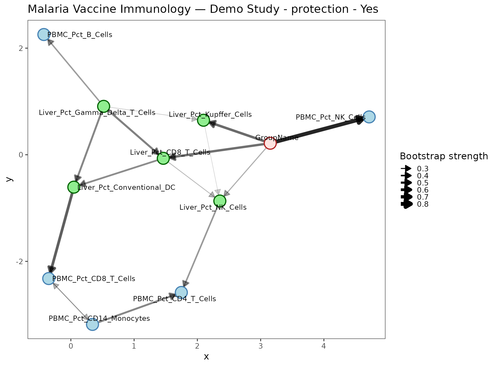
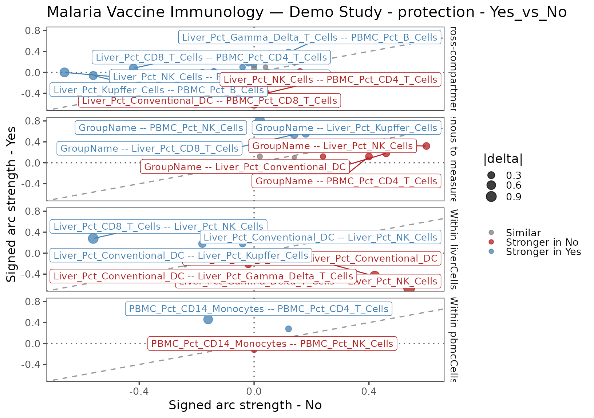

# Getting Started with networkR

## What this vignette does

This vignette walks you through every stage of the `networkR` pipeline
using **fully synthetic data** that mimics a multi-tissue malaria
vaccine immunology study. No real data files are needed — the mock
panels are generated inline and written to a temporary directory. By the
end you will have:

- generated and inspected raw long-format flow-cytometry panels;
- configured a pipeline for two tissue compartments and two
  stratifications;
- traced data through imputation, discretization, and blacklist
  construction;
- learned and plotted Bayesian network structure on the full cohort;
- compared network structure between exposure groups (Malaria Preexposed
  vs. Naive) and between protection outcomes (Protected vs. Not
  protected).

------------------------------------------------------------------------

## 1. Background: Bayesian Networks for immunology

### 1.1 What is a Bayesian Network?

A **Bayesian Network (BN)** is a probabilistic graphical model whose
structure is a directed acyclic graph (DAG). Each node $X_{i}$
represents a variable; each directed edge
$\left. X_{j}\rightarrow X_{i} \right.$ encodes that $X_{j}$ is a direct
probabilistic predictor of $X_{i}$ after conditioning on all other
parents. The joint distribution factorises along the graph:

$$P\left( X_{1},\ldots,X_{n} \right) = \prod\limits_{i = 1}^{n}P\!\left( X_{i} \mid \text{pa}\left( X_{i} \right) \right)$$

where $\text{pa}\left( X_{i} \right)$ is the **parent set** of $X_{i}$.
Missing edges denote *conditional independence*:
$X_{i}\bot\!\!\!\bot X_{j} \mid \{ X_{k}:k \neq i,j\}$. This makes BNs
useful for teasing apart direct from indirect associations in
high-dimensional immunological data.

### 1.2 Variable tiers

`networkR` formalises a **tier system** that encodes causal precedence
between variable classes. Arcs that would run from a lower-priority tier
into a higher-priority tier are *blacklisted* before structure learning
begins.

| Tier | Variable class                 | Examples                                      | Rationale                                   |
|------|--------------------------------|-----------------------------------------------|---------------------------------------------|
| 1    | Exogenous / design             | `GroupName`, `VaccinationStatus`, `Timepoint` | Fixed before any biological measurement     |
| 2    | Upstream tissue measurements   | `Liver_Pct_*`                                 | Liver is exposed to malaria parasites first |
| 3    | Downstream tissue measurements | `PBMC_Pct_*`, `BM_Pct_*`                      | Systemic immunity reflects hepatic priming  |

Three blacklist components are constructed automatically:

1.  **Measurement → Exogenous** — no cellular proportion can cause a
    design variable.
2.  **Exogenous → Exogenous** — design factors are mutually independent
    by construction (factorial design assumption; configurable).
3.  **Cross-tier (high tier → low tier)** — e.g. PBMC cells (tier 3)
    cannot be parents of Liver cells (tier 2).

Compartment identity is encoded structurally through the measurement
column prefixes and `measurementGroups` definitions, not as a separate
row-level `Tissue` node. That lets the network learn within- and
cross-compartment relationships from paired subject-level measurements
while still using measurement groups for node colouring and tier-aware
blacklist construction.

### 1.3 Bootstrap stability and the averaged network

Because the data are finite, a single structure-learning run is
sensitive to sampling noise. `networkR` uses **bootstrap resampling**
(Friedman et al. 1999): $R$ bootstrap datasets are drawn and a network
is learned on each. The **arc stability** of an edge
$\left. A\rightarrow B \right.$ is the fraction of bootstrap networks
that contain $\left. A\rightarrow B \right.$*or*
$\left. B\rightarrow A \right.$ (direction is assessed separately by the
`direction` field of `boot.strength()`).

The **averaged network** retains only arcs whose stability exceeds a
threshold (default 0.40 for real studies; we use 0.20 here for the small
demo dataset).

### 1.4 Signed arc strength

Raw bootstrap strength is unsigned. `networkR` multiplies it by the sign
of the Pearson correlation between the two nodes on continuous
(pre-discretization) data, giving a **signed strength** $s$:

$$s_{AB} = \text{sign}\left( r_{AB} \right) \times {\widehat{p}}_{AB}$$

where ${\widehat{p}}_{AB}$ is bootstrap arc probability and $r_{AB}$ is
Pearson $r$. The **delta**
$\Delta = s_{\text{group}_{1}} - s_{\text{group}_{2}}$ summarises
directional enrichment of an edge between two cohorts.

------------------------------------------------------------------------

## 2. Mock data: a simulated malaria vaccine study

### 2.1 Study design

The simulated cohort has **24 subjects** divided into three experimental
groups, each measured in two tissue compartments (Liver and PBMC) at a
single timepoint (`D1`). This yields **24 rows** in the joined subject
table after
[`ReadPanels()`](https://gwmcelfresh.github.io/networkR/reference/DataFunctions.md)
— one row per subject, with Liver and PBMC features occupying separate
column groups.

| Group              |   n | Vaccination status | Protection outcome |
|:-------------------|----:|:-------------------|:-------------------|
| Malaria Preexposed |   8 | Vaccinated         | Yes / No (4 each)  |
| Malaria Naive      |   8 | Vaccinated         | Yes / No (4 each)  |
| Control Animal     |   8 | Unvaccinated       | N/A                |

Simulated study design (24 subjects total)

Subjects S01–S08 are Malaria Preexposed (vaccinated); S09–S16 are
Malaria Naive (vaccinated); S17–S24 are Control Animals (unvaccinated,
no protection outcome).

### 2.2 Data-generation helpers

We simulate cell-type proportions using the **Dirichlet distribution**.
The group-specific concentration parameters $\mathbf{α}$ encode
biological signal: Preexposed animals have relatively elevated Kupffer
cells (Liver) and CD8 T cells (PBMC), while Control Animals have flatter
distributions consistent with a naive systemic immune state.

``` r
# Dirichlet draw for a single observation.
# Exploits: if G_i ~ Gamma(alpha_i, 1) then G / sum(G) ~ Dirichlet(alpha).
rdirichlet_one <- function(alpha) {
  raw <- vapply(alpha, function(a) stats::rgamma(1, shape = a, rate = 1), numeric(1))
  raw / sum(raw)
}

# Build a long-format panel table (one row per subject × cell type).
make_panel_long <- function(cell_types, alpha_by_group,
                             subjects, groups, protection, seed) {
  set.seed(seed)
  rows <- lapply(seq_along(subjects), function(i) {
    fracs <- rdirichlet_one(alpha_by_group[[groups[i]]])
    data.frame(
      SubjectId       = subjects[i],
      TimepointLabel2 = "D1",
      GroupName       = groups[i],
      Protection      = protection[i],
      CellType        = cell_types,
      Fraction        = fracs,
      stringsAsFactors = FALSE
    )
  })
  do.call(rbind, rows)
}
```

### 2.3 Generating the Liver panel

Five liver cell types are simulated. The Dirichlet $\mathbf{α}$ shapes
differ by group: Preexposed animals have a higher $\alpha$ for Kupffer
Cells (resident macrophages that capture malaria parasites), while Naive
and Control animals show more uniform distributions.

``` r
# Subject metadata
n_subjects      <- 24
subject_ids     <- sprintf("S%02d", 1:n_subjects)
group_labels    <- rep(c("Malaria Preexposed", "Malaria Naive", "Control Animal"), each = 8)
protection_raw  <- c(
  rep(c("Yes", "No"), each = 4),  # S01-S08 Preexposed: 4 protected, 4 not
  rep(c("Yes", "No"), each = 4),  # S09-S16 Naive: 4 protected, 4 not
  rep("No", 8)                    # S17-S24 Controls: placeholder → overwritten to NA
)

# Liver cell types and group-specific Dirichlet alpha vectors
liver_cell_types <- c(
  "Kupffer Cells", "CD8 T Cells", "NK Cells",
  "Gamma Delta T Cells", "Conventional DC"
)
liver_alpha <- list(
  "Malaria Preexposed" = c(5.0, 2.0, 2.0, 1.0, 0.8),  # elevated Kupffer + moderate NK
  "Malaria Naive"      = c(2.0, 3.0, 3.0, 1.5, 0.5),  # elevated CD8 / NK
  "Control Animal"     = c(1.0, 1.0, 2.5, 1.0, 0.5)   # relatively flat; more NK
)

liver_panel <- make_panel_long(
  liver_cell_types, liver_alpha, subject_ids, group_labels, protection_raw, seed = 42
)
# Add ~10 % random missing values to simulate instrument dropouts
set.seed(7)
liver_panel$Fraction[sample(nrow(liver_panel), floor(nrow(liver_panel) * 0.10))] <- NA

cat("Liver panel: ", nrow(liver_panel), "rows × ", ncol(liver_panel), "columns\n")
#> Liver panel:  120 rows ×  6 columns
cat("Missing Fraction values:", sum(is.na(liver_panel$Fraction)), "\n")
#> Missing Fraction values: 12
```

|     | SubjectId | TimepointLabel2 | GroupName          | Protection | CellType            | Fraction |
|:----|:----------|:----------------|:-------------------|:-----------|:--------------------|---------:|
| 2   | S01       | D1              | Malaria Preexposed | Yes        | CD8 T Cells         |    0.071 |
| 5   | S01       | D1              | Malaria Preexposed | Yes        | Conventional DC     |    0.178 |
| 4   | S01       | D1              | Malaria Preexposed | Yes        | Gamma Delta T Cells |    0.002 |
| 1   | S01       | D1              | Malaria Preexposed | Yes        | Kupffer Cells       |    0.625 |
| 3   | S01       | D1              | Malaria Preexposed | Yes        | NK Cells            |    0.124 |
| 7   | S02       | D1              | Malaria Preexposed | Yes        | CD8 T Cells         |    0.034 |
| 10  | S02       | D1              | Malaria Preexposed | Yes        | Conventional DC     |    0.000 |
| 9   | S02       | D1              | Malaria Preexposed | Yes        | Gamma Delta T Cells |    0.294 |
| 6   | S02       | D1              | Malaria Preexposed | Yes        | Kupffer Cells       |    0.369 |
| 8   | S02       | D1              | Malaria Preexposed | Yes        | NK Cells            |       NA |

First 10 rows of the raw Liver panel (long format)

### 2.4 Generating the PBMC panel

``` r
pbmc_cell_types <- c(
  "CD14 Monocytes", "CD4 T Cells", "CD8 T Cells", "NK Cells", "B Cells"
)
pbmc_alpha <- list(
  "Malaria Preexposed" = c(2.0, 2.0, 4.5, 2.0, 0.5),  # strong CD8 enrichment
  "Malaria Naive"      = c(3.5, 3.0, 2.0, 2.0, 0.5),  # monocyte / CD4 skew
  "Control Animal"     = c(4.5, 2.0, 1.0, 1.0, 0.5)   # monocyte dominated
)

pbmc_panel <- make_panel_long(
  pbmc_cell_types, pbmc_alpha, subject_ids, group_labels, protection_raw, seed = 99
)
set.seed(8)
pbmc_panel$Fraction[sample(nrow(pbmc_panel), floor(nrow(pbmc_panel) * 0.10))] <- NA

cat("PBMC panel:", nrow(pbmc_panel), "rows × ", ncol(pbmc_panel), "columns\n")
#> PBMC panel: 120 rows ×  6 columns
cat("Missing Fraction values:", sum(is.na(pbmc_panel$Fraction)), "\n")
#> Missing Fraction values: 12
```

### 2.5 Writing panels to disk

[`ReadPanels()`](https://gwmcelfresh.github.io/networkR/reference/DataFunctions.md)
discovers files by globbing `dataPath` for filenames matching
`filePattern`. The tissue compartment is parsed from the filename: any
file containing `"liver"` (case-insensitive) maps to the canonical label
`"Liver"`.

``` r
panel_dir <- file.path(tempdir(), "networkR_vignette_panels")
dir.create(panel_dir, recursive = TRUE, showWarnings = FALSE)
utils::write.csv(liver_panel, file.path(panel_dir, "liver_panel.csv"), row.names = FALSE)
utils::write.csv(pbmc_panel,  file.path(panel_dir, "pbmc_panel.csv"),  row.names = FALSE)
cat("Panel files written to:", panel_dir, "\n")
#> Panel files written to: /tmp/RtmpmNqYjw/networkR_vignette_panels
list.files(panel_dir)
#> [1] "liver_panel.csv" "pbmc_panel.csv"
```

------------------------------------------------------------------------

## 3. Configuration

### 3.1 Configuration concepts

`networkR` is configured entirely through a named R list produced by
[`BuildConfiguration()`](https://gwmcelfresh.github.io/networkR/reference/ConfigurationFunctions.md)
(or equivalently
[`ParseConfiguration()`](https://gwmcelfresh.github.io/networkR/reference/ConfigurationFunctions.md)
for a YAML file). The configuration controls every stage of the
pipeline:

| Section             | Key parameters                                                                       |
|---------------------|--------------------------------------------------------------------------------------|
| `study`             | `studyName`, `randomSeed`                                                            |
| `data`              | `dataPath`, `filePattern`, column name mappings, tissue map                          |
| `variables`         | `exogenousVariables`, `stratifierVariables`, `derivedVariables`, `measurementGroups` |
| `imputation`        | `method` (pmm), `numberOfImputations`, `maximumIterations`                           |
| `discretization`    | `method` (hartemink), `initialBreaks`, `finalBreaks`, `fallbackBreaks`               |
| `structureLearning` | `algorithms`, `bootstrapReplicates`, `averageNetworkThreshold`                       |
| `stratifications`   | List of cohort stratification definitions                                            |
| `plotting`          | Layout, colours, sizes                                                               |
| `output`            | Save paths and file format                                                           |

### 3.2 Building the vignette configuration

We override only the parameters that differ from the package defaults.
Key demo choices: **50 bootstrap replicates** and
**`averageNetworkThreshold = 0.2`** to ensure a non-trivial averaged
network from a small dataset. A real study should use $R \geq 1000$
replicates and `averageNetworkThreshold = 0.4`.

``` r
configuration <- BuildConfiguration(list(
  study = list(
    studyName  = "Malaria Vaccine Immunology — Demo Study",
    randomSeed = 42
  ),
  data = list(
    dataPath    = panel_dir,
    filePattern = "[.](csv)$"
  ),
  variables = list(
    measurementGroups = list(
      list(
        groupName      = "liverCells",
        columnPrefixes = list("Liver_"),
        tier           = 2,
        fillColour     = "lightgreen",
        borderColour   = "darkgreen"
      ),
      list(
        groupName      = "pbmcCells",
        columnPrefixes = list("PBMC_"),
        tier           = 3,
        fillColour     = "lightblue",
        borderColour   = "steelblue"
      )
    )
  ),
  imputation = list(
    numberOfImputations = 3,
    maximumIterations   = 5
  ),
  structureLearning = list(
    algorithms                 = list("tabu"),
    selectedBootstrapAlgorithm = "tabu",
    bootstrapReplicates        = 50,
    averageNetworkThreshold    = 0.2
  ),
  stratifications = list(
    list(
      analysisName = "exposure",
      variableName = "GroupName",
      levels       = list("Malaria Preexposed", "Malaria Naive"),
      filters      = list()
    ),
    list(
      analysisName = "protection",
      variableName = "Protection",
      levels       = list("Yes", "No"),
      filters      = list(
        list(column = "VaccinationStatus", operator = "equals",    value = "Vaccinated"),
        list(column = "Protection",        operator = "notMissing")
      )
    )
  ),
  output = list(savePlots = FALSE)
))

print(configuration)
#> networkR configuration
#>   Study name: Malaria Vaccine Immunology — Demo Study
#>   Data path: /tmp/RtmpmNqYjw/networkR_vignette_panels
#>   Exogenous variables: GroupName, VaccinationStatus, Timepoint
#>   Measurement groups: liverCells, pbmcCells
```

A YAML file equivalent to the above is available at
`system.file("configuration_template.yml", package = "networkR")`.

------------------------------------------------------------------------

## 4. Running the full pipeline

[`RunPipeline()`](https://gwmcelfresh.github.io/networkR/reference/RunPipeline.md)
is the one-call entry point. It executes the complete chain — ingestion,
derived-variable annotation, imputation, discretization, full-model
structure learning, stratified sub-models, and pairwise structure
comparisons — and returns a single `networkRPipelineResult` object
containing every intermediate result and plot.

``` r
set.seed(42)
pipeline_result <- RunPipeline(configuration)
print(pipeline_result)
#> networkR pipeline result
#>   Study name: Malaria Vaccine Immunology — Demo Study
#>   Rows: 24
#>   Measurement columns: 10
#>   Stratified analyses: 2
```

The remainder of this vignette unpacks each component of
`pipeline_result` in detail.

------------------------------------------------------------------------

## 5. Panel ingestion

### 5.1 How `ReadPanels()` works

[`ReadPanels()`](https://gwmcelfresh.github.io/networkR/reference/DataFunctions.md)
discovers all files in `configuration$data$dataPath` whose names match
`configuration$data$filePattern`. For each file it:

1.  Reads the raw long-format table (xlsx or csv).
2.  Parses the tissue compartment from the filename using
    `configuration$data$tissueMap`.
3.  Renames `TimepointLabel2 → Timepoint` (or whatever your
    `rawTimepointColumn`/`analysisTimepointColumn` mapping specifies).
4.  Normalises `CellType` strings to valid column names and prefixes
    them with `{Tissue}_{cellTypePrefix}` (e.g. `"Kupffer Cells"` →
    `"Liver_Pct_Kupffer_Cells"`).
5.  Pivots from long to wide, producing one subject × timepoint row per
    tissue panel.

The individual pivoted tables are then **`full_join`-ed** on the shared
key columns (`SubjectId`, `Timepoint`, `Protection`, `GroupName`).
Because tissue identity already lives in the measurement column
prefixes, the join produces **one row per subject** with both `Liver_`
and `PBMC_` columns aligned side by side. Missing values after the join
therefore reflect genuine assay dropouts rather than a structural
cross-tissue design artifact.

``` r
# The individual functions — equivalent to what RunPipeline calls internally:
subject_table <- ReadPanels(configuration)
subject_table <- AddDerivedVariables(subject_table, configuration)
```

### 5.2 The joined subject table

``` r
st <- pipeline_result$subjectTable
cat("Subject table dimensions:", nrow(st), "rows ×", ncol(st), "columns\n\n")
#> Subject table dimensions: 24 rows × 15 columns

# Column inventory
meas_cols <- grep("^(Liver|PBMC)_", colnames(st), value = TRUE)
cat("Measurement columns (", length(meas_cols), "):\n", sep = "")
#> Measurement columns (10):
cat(paste(meas_cols, collapse = ", "), "\n\n")
#> Liver_Pct_CD8_T_Cells, Liver_Pct_Conventional_DC, Liver_Pct_Gamma_Delta_T_Cells, Liver_Pct_Kupffer_Cells, Liver_Pct_NK_Cells, PBMC_Pct_B_Cells, PBMC_Pct_CD14_Monocytes, PBMC_Pct_CD4_T_Cells, PBMC_Pct_CD8_T_Cells, PBMC_Pct_NK_Cells

# Measurement missingness pattern
na_counts <- colSums(is.na(st[, meas_cols]))
cat("NA counts per measurement column:\n")
#> NA counts per measurement column:
print(na_counts)
#>         Liver_Pct_CD8_T_Cells     Liver_Pct_Conventional_DC 
#>                             0                             0 
#> Liver_Pct_Gamma_Delta_T_Cells       Liver_Pct_Kupffer_Cells 
#>                             0                             0 
#>            Liver_Pct_NK_Cells              PBMC_Pct_B_Cells 
#>                             0                             0 
#>       PBMC_Pct_CD14_Monocytes          PBMC_Pct_CD4_T_Cells 
#>                             0                             0 
#>          PBMC_Pct_CD8_T_Cells             PBMC_Pct_NK_Cells 
#>                             0                             0
```

| SubjectId | GroupName          | Protection | VaccinationStatus | Timepoint |
|:----------|:-------------------|:-----------|:------------------|:----------|
| S01       | Malaria Preexposed | Yes        | Vaccinated        | D1        |
| S02       | Malaria Preexposed | Yes        | Vaccinated        | D1        |
| S03       | Malaria Preexposed | Yes        | Vaccinated        | D1        |
| S04       | Malaria Preexposed | Yes        | Vaccinated        | D1        |
| S05       | Malaria Preexposed | No         | Vaccinated        | D1        |
| S06       | Malaria Preexposed | No         | Vaccinated        | D1        |
| S07       | Malaria Preexposed | No         | Vaccinated        | D1        |
| S08       | Malaria Preexposed | No         | Vaccinated        | D1        |
| S09       | Malaria Naive      | Yes        | Vaccinated        | D1        |
| S10       | Malaria Naive      | Yes        | Vaccinated        | D1        |
| S11       | Malaria Naive      | Yes        | Vaccinated        | D1        |
| S12       | Malaria Naive      | Yes        | Vaccinated        | D1        |

First 12 rows of the joined subject table (design columns only)

Each row now represents one subject-timepoint observation with both
tissue compartments present as separate feature blocks. In this
synthetic example, any remaining `NA` values in the measurement columns
arise from the simulated assay dropouts we injected into the raw panels.

### 5.3 Derived variables

[`AddDerivedVariables()`](https://gwmcelfresh.github.io/networkR/reference/DataFunctions.md)
applies two rules defined in `configuration$variables$derivedVariables`:

- **`VaccinationStatus`** (`ifEquals`): set to `"Unvaccinated"` when
  `GroupName == "Control Animal"`, otherwise `"Vaccinated"`.
- **`Protection`** (`replaceTargetWhenEquals`): overwrite `Protection`
  with `NA` when `GroupName == "Control Animal"`. The raw CSV value for
  controls is irrelevant.

``` r
cat("VaccinationStatus distribution:\n")
#> VaccinationStatus distribution:
print(table(st$VaccinationStatus, useNA = "ifany"))
#> 
#> Unvaccinated   Vaccinated 
#>            8           16
cat("\nProtection distribution:\n")
#> 
#> Protection distribution:
print(table(st$Protection, useNA = "ifany"))
#> 
#>   No  Yes <NA> 
#>    8    8    8
```

------------------------------------------------------------------------

## 6. Missing-data imputation

### 6.1 MICE and predictive mean matching

All missing values in the measurement columns are imputed before
structure learning. `networkR` uses **Multiple Imputation by Chained
Equations (MICE)** with **predictive mean matching** (`method = "pmm"`
by default). PMM preserves the empirical marginal distribution of each
variable: the imputed value is always a real observed value from a donor
matched on predicted values.

Because the joined analysis table is now **subject-level**, all
compartments for a given subject sit in the same row. MICE therefore
uses real paired cross-compartment measurements as predictors when
filling assay dropouts, rather than reconstructing an entire missing
tissue block from a row-level `Tissue` indicator.

If MICE fails (e.g. too few rows relative to predictors in a small
sub-cohort),
[`ImputeMeasurements()`](https://gwmcelfresh.github.io/networkR/reference/DataFunctions.md)
automatically falls back to **column-wise median imputation** and emits
a warning.

``` r
# Equivalent single-step call:
imputation_result <- ImputeMeasurements(pipeline_result$subjectTable, configuration)
```

### 6.2 Imputation result

``` r
ir <- pipeline_result$imputationResult

cat("Measurement columns imputed (", length(ir$measurementColumns), "):\n", sep = "")
#> Measurement columns imputed (10):
cat(paste(ir$measurementColumns, collapse = "\n"), "\n\n")
#> Liver_Pct_CD8_T_Cells
#> Liver_Pct_Conventional_DC
#> Liver_Pct_Gamma_Delta_T_Cells
#> Liver_Pct_Kupffer_Cells
#> Liver_Pct_NK_Cells
#> PBMC_Pct_B_Cells
#> PBMC_Pct_CD14_Monocytes
#> PBMC_Pct_CD4_T_Cells
#> PBMC_Pct_CD8_T_Cells
#> PBMC_Pct_NK_Cells

# NA counts before vs. after
n_na_before <- sum(is.na(pipeline_result$subjectTable[, ir$measurementColumns]))
n_na_after  <- sum(is.na(ir$continuousAnalysisData[, ir$measurementColumns]))
cat("NAs before imputation:", n_na_before, "\n")
#> NAs before imputation: 0
cat("NAs after  imputation:", n_na_after,  "\n\n")
#> NAs after  imputation: 0

cat("Active exogenous variables:", paste(ir$exogenousVariables, collapse = ", "), "\n")
#> Active exogenous variables: GroupName, VaccinationStatus, Timepoint
cat("Stratifier variables (not imputed):", paste(ir$stratifierVariables, collapse = ", "), "\n")
#> Stratifier variables (not imputed): Protection
```

The `continuousAnalysisData` slot holds the imputed continuous values
(used later for computing signed arc strengths via Pearson
correlations). The `imputedData` slot holds the same values plus the
subject-level metadata columns.

------------------------------------------------------------------------

## 7. Discretization

### 7.1 Hartemink’s algorithm

Bayesian network score functions for categorical variables require
discrete (factor) inputs. `networkR` uses **Hartemink’s pairwise
mutual-information algorithm**
(`bnlearn::discretize(method = "hartemink")`) to choose cut points that
maximise the pairwise mutual information across all pairs of measurement
variables jointly. This is preferable to per-column quantile binning
because it is sensitive to the covariance structure of the data.

The algorithm requires sufficient within-cell counts for an initial
$q$-quantile preprocessing pass (`initialBreaks = 20` by default).
Columns that cannot satisfy this requirement (too few distinct values or
too few rows) are routed to a **quantile-based fallback**
(`fallbackBreaks = 2`), which simply splits at the median.

``` r
# Equivalent:
discretization_result <- DiscretizeMeasurements(imputation_result, configuration)
```

### 7.2 Column routing

``` r
dr <- pipeline_result$discretizationResult

cat("Total measurement columns:", length(dr$measurementColumns), "\n")
#> Total measurement columns: 10
cat("Hartemink columns (", length(dr$harteminkColumns), "):\n", sep = "")
#> Hartemink columns (5):
cat(paste(dr$harteminkColumns, collapse = "\n"), "\n\n")
#> Liver_Pct_Gamma_Delta_T_Cells
#> Liver_Pct_Kupffer_Cells
#> PBMC_Pct_B_Cells
#> PBMC_Pct_CD14_Monocytes
#> PBMC_Pct_NK_Cells

if (length(dr$fallbackColumns) > 0) {
  cat("Fallback columns (", length(dr$fallbackColumns), "):\n", sep = "")
  cat(paste(dr$fallbackColumns, collapse = "\n"), "\n")
} else {
  cat("Fallback columns: none — all columns passed the Hartemink pre-check.\n")
}
#> Fallback columns (5):
#> Liver_Pct_CD8_T_Cells
#> Liver_Pct_Conventional_DC
#> Liver_Pct_NK_Cells
#> PBMC_Pct_CD4_T_Cells
#> PBMC_Pct_CD8_T_Cells
```

### 7.3 Discrete factor levels

After discretization every measurement column is an ordered factor with
`finalBreaks = 3` levels by default. The Hartemink algorithm determines
cut points jointly; levels are labelled `1`, `2`, `3` (low to high
within each column’s marginal distribution).

``` r
first_three <- dr$measurementColumns[1:3]
lvl_display <- lapply(first_three, function(cn) {
  x <- dr$discreteData[[cn]]
  data.frame(
    variable = cn,
    `n levels` = nlevels(x),
    levels = paste(levels(x), collapse = " / "),
    check.names = FALSE
  )
})
knitr::kable(do.call(rbind, lvl_display), caption = "Factor levels for first three measurement columns")
```

| variable                      | n levels | levels                                                                |
|:------------------------------|---------:|:----------------------------------------------------------------------|
| Liver_Pct_CD8_T_Cells         |        2 | \[0,0.190936\] / (0.190936,0.699289\]                                 |
| Liver_Pct_Conventional_DC     |        2 | \[0,0.0287885\] / (0.0287885,0.317797\]                               |
| Liver_Pct_Gamma_Delta_T_Cells |        3 | \[0.00190251,0.165937\] / (0.165937,0.247151\] / (0.247151,0.423564\] |

Factor levels for first three measurement columns

| GroupName          | Liver_Pct_CD8_T_Cells | Liver_Pct_Conventional_DC | Liver_Pct_Gamma_Delta_T_Cells |
|:-------------------|:----------------------|:--------------------------|:------------------------------|
| Malaria Preexposed | \[0,0.190936\]        | (0.0287885,0.317797\]     | \[0.00190251,0.165937\]       |
| Malaria Preexposed | \[0,0.190936\]        | \[0,0.0287885\]           | (0.247151,0.423564\]          |
| Malaria Preexposed | (0.190936,0.699289\]  | \[0,0.0287885\]           | \[0.00190251,0.165937\]       |
| Malaria Preexposed | \[0,0.190936\]        | (0.0287885,0.317797\]     | (0.165937,0.247151\]          |
| Malaria Preexposed | \[0,0.190936\]        | \[0,0.0287885\]           | (0.165937,0.247151\]          |
| Malaria Preexposed | (0.190936,0.699289\]  | (0.0287885,0.317797\]     | \[0.00190251,0.165937\]       |
| Malaria Preexposed | (0.190936,0.699289\]  | (0.0287885,0.317797\]     | (0.165937,0.247151\]          |
| Malaria Preexposed | (0.190936,0.699289\]  | \[0,0.0287885\]           | \[0.00190251,0.165937\]       |

First 8 rows of discrete data (design + first three measurement columns)

------------------------------------------------------------------------

## 8. Blacklist construction

### 8.1 The three blacklist components

[`BuildBlacklist()`](https://gwmcelfresh.github.io/networkR/reference/AnalysisFunctions.md)
assembles a `data.frame` of forbidden arcs (`from`, `to`) from three
sources:

1.  **Measurement → Exogenous**: Every arc from any measurement column
    into any active exogenous variable is forbidden (cellular
    proportions cannot *cause* group assignments).
2.  **Exogenous → Exogenous**: Arcs between exogenous variables are
    forbidden (factorial design assumption — modify if your exogenous
    variables are correlated).
3.  **Tier cross-arcs**: Arcs from measurement group $A$ into
    measurement group $B$ are forbidden whenever
    $\text{tier}(A) > \text{tier}(B)$ — i.e. downstream-tissue cells
    (PBMC, tier 3) cannot be parents of upstream-tissue cells (Liver,
    tier 2).

``` r
# Equivalent:
blacklist_result <- BuildBlacklist(discretization_result, configuration)
```

### 8.2 Examining the blacklist

``` r
bl <- pipeline_result$fullModelResult$blacklist

cat("Total blacklisted arcs:", nrow(bl), "\n\n")
#> Total blacklisted arcs: 47

# Breakdown by arc category
is_exo_src <- bl$from %in% pipeline_result$fullModelResult$activeExogenousVariables
is_exo_tgt <- bl$to   %in% pipeline_result$fullModelResult$activeExogenousVariables

cat("Arcs blocked: measurement → exogenous: ",
    sum(!is_exo_src &  is_exo_tgt), "\n",
    "Arcs blocked: exogenous → exogenous:  ",
    sum( is_exo_src &  is_exo_tgt), "\n",
    "Arcs blocked: high-tier → low-tier:   ",
    sum(!is_exo_src & !is_exo_tgt), "\n", sep = "")
#> Arcs blocked: measurement → exogenous: 20
#> Arcs blocked: exogenous → exogenous:  2
#> Arcs blocked: high-tier → low-tier:   25
```

| from                          | to                |
|:------------------------------|:------------------|
| Liver_Pct_CD8_T_Cells         | GroupName         |
| Liver_Pct_Conventional_DC     | GroupName         |
| Liver_Pct_Gamma_Delta_T_Cells | GroupName         |
| Liver_Pct_Kupffer_Cells       | GroupName         |
| Liver_Pct_NK_Cells            | GroupName         |
| PBMC_Pct_B_Cells              | GroupName         |
| PBMC_Pct_CD14_Monocytes       | GroupName         |
| PBMC_Pct_CD4_T_Cells          | GroupName         |
| PBMC_Pct_CD8_T_Cells          | GroupName         |
| PBMC_Pct_NK_Cells             | GroupName         |
| Liver_Pct_CD8_T_Cells         | VaccinationStatus |
| Liver_Pct_Conventional_DC     | VaccinationStatus |
| Liver_Pct_Gamma_Delta_T_Cells | VaccinationStatus |
| Liver_Pct_Kupffer_Cells       | VaccinationStatus |
| Liver_Pct_NK_Cells            | VaccinationStatus |

First 15 rows of the blacklist (from → to arcs that cannot exist)

------------------------------------------------------------------------

## 9. Structure learning

### 9.1 Tabu search

`networkR` supports Hill-Climbing (`"hillClimbing"`) and **Tabu search**
(`"tabu"`) for score-based BN structure learning. Tabu search augments
greedy hill-climbing with a recency memory (the *tabu list*) that
forbids recently reversed moves, helping it escape local optima. Both
algorithms optimise the **BIC score** for discrete data by default.

After learning the single best-scoring network on the full dataset,
`networkR` runs **bootstrap resampling**: it draws $R$ datasets with
replacement and re-runs Tabu search on each, then aggregates arc
frequencies into a `boot.strength` table.

``` r
# Equivalent:
structure_result <- LearnBayesianNetwork(discretization_result, configuration)
```

### 9.2 BIC score

``` r
sr <- pipeline_result$fullModelResult
cat("BIC scores by algorithm:\n")
#> BIC scores by algorithm:
print(round(sr$networkScores, 2))
#>    tabu 
#> -249.39
```

### 9.3 Bootstrap arc strength

Each row in the `bootstrapStrength` table is a directed arc
(`from → to`) and its estimated stability (`strength`) and direction
probability (`direction`). We sort by stability descending to see the
most robustly supported edges.

``` r
bs <- as.data.frame(sr$bootstrapStrength)
bs <- bs[order(-bs$strength), ]
knitr::kable(
  head(bs, 15),
  digits = 3,
  row.names = FALSE,
  caption = "Top 15 arcs by bootstrap stability (strength = fraction of bootstrap networks containing the arc)"
)
```

| from                          | to                            | strength | direction |
|:------------------------------|:------------------------------|---------:|----------:|
| VaccinationStatus             | PBMC_Pct_CD14_Monocytes       |     0.96 |       1.0 |
| PBMC_Pct_CD14_Monocytes       | VaccinationStatus             |     0.96 |       0.0 |
| Liver_Pct_Gamma_Delta_T_Cells | PBMC_Pct_B_Cells              |     0.86 |       1.0 |
| PBMC_Pct_B_Cells              | Liver_Pct_Gamma_Delta_T_Cells |     0.86 |       0.0 |
| Liver_Pct_Conventional_DC     | PBMC_Pct_CD4_T_Cells          |     0.68 |       1.0 |
| PBMC_Pct_CD4_T_Cells          | Liver_Pct_Conventional_DC     |     0.68 |       0.0 |
| VaccinationStatus             | Liver_Pct_Conventional_DC     |     0.50 |       1.0 |
| Liver_Pct_Conventional_DC     | VaccinationStatus             |     0.50 |       0.0 |
| Liver_Pct_CD8_T_Cells         | Liver_Pct_Gamma_Delta_T_Cells |     0.42 |       0.5 |
| Liver_Pct_Gamma_Delta_T_Cells | Liver_Pct_CD8_T_Cells         |     0.42 |       0.5 |
| GroupName                     | Liver_Pct_NK_Cells            |     0.36 |       1.0 |
| GroupName                     | PBMC_Pct_CD8_T_Cells          |     0.36 |       1.0 |
| Liver_Pct_NK_Cells            | GroupName                     |     0.36 |       0.0 |
| PBMC_Pct_CD8_T_Cells          | GroupName                     |     0.36 |       0.0 |
| VaccinationStatus             | Liver_Pct_Gamma_Delta_T_Cells |     0.34 |       1.0 |

Top 15 arcs by bootstrap stability (strength = fraction of bootstrap
networks containing the arc)

### 9.4 The averaged network

The averaged network retains only arcs whose stability exceeds
`averageNetworkThreshold` (here 0.20). This is the network visualized
and compared downstream.

``` r
cat("Averaged network threshold:", sr$threshold, "\n\n")
#> Averaged network threshold: 0.2
avg_arcs <- bnlearn::arcs(sr$averagedNetwork)
cat("Arcs in the averaged network (", nrow(avg_arcs), "):\n", sep = "")
#> Arcs in the averaged network (17):
if (nrow(avg_arcs) > 0) {
  knitr::kable(avg_arcs, row.names = FALSE)
} else {
  cat("No arcs exceeded the threshold — try lowering averageNetworkThreshold.\n")
}
```

| from                          | to                            |
|:------------------------------|:------------------------------|
| GroupName                     | Liver_Pct_NK_Cells            |
| GroupName                     | PBMC_Pct_CD4_T_Cells          |
| GroupName                     | PBMC_Pct_CD8_T_Cells          |
| VaccinationStatus             | Liver_Pct_Conventional_DC     |
| VaccinationStatus             | Liver_Pct_Gamma_Delta_T_Cells |
| VaccinationStatus             | PBMC_Pct_CD14_Monocytes       |
| Liver_Pct_CD8_T_Cells         | Liver_Pct_Gamma_Delta_T_Cells |
| Liver_Pct_CD8_T_Cells         | PBMC_Pct_CD8_T_Cells          |
| Liver_Pct_Conventional_DC     | PBMC_Pct_CD4_T_Cells          |
| Liver_Pct_Conventional_DC     | PBMC_Pct_CD8_T_Cells          |
| Liver_Pct_Gamma_Delta_T_Cells | Liver_Pct_CD8_T_Cells         |
| Liver_Pct_Gamma_Delta_T_Cells | PBMC_Pct_B_Cells              |
| Liver_Pct_Kupffer_Cells       | Liver_Pct_CD8_T_Cells         |
| Liver_Pct_Kupffer_Cells       | Liver_Pct_NK_Cells            |
| Liver_Pct_Kupffer_Cells       | PBMC_Pct_NK_Cells             |
| Liver_Pct_NK_Cells            | Liver_Pct_Conventional_DC     |
| Liver_Pct_NK_Cells            | PBMC_Pct_CD8_T_Cells          |

------------------------------------------------------------------------

## 10. Network visualization

[`PlotBayesianNetwork()`](https://gwmcelfresh.github.io/networkR/reference/PlotFunctions.md)
renders the averaged network using `ggraph` with a Fruchterman-Reingold
(`"fr"`) force-directed layout. Node colours encode membership in a
measurement group or exogenous category; edge width and transparency
encode bootstrap stability.

**Node colour scheme for this demo:**

| Node type                  | Fill       | Border    |
|----------------------------|------------|-----------|
| Exogenous variables        | mistyrose  | firebrick |
| Liver cells (`liverCells`) | lightgreen | darkgreen |
| PBMC cells (`pbmcCells`)   | lightblue  | steelblue |

``` r
pipeline_result$plotObjects$fullModel
```



Wider edges and more opaque edges indicate higher bootstrap stability.
The node layout is stochastic (force-directed); run with
[`set.seed()`](https://rdrr.io/r/base/Random.html) before
[`PlotBayesianNetwork()`](https://gwmcelfresh.github.io/networkR/reference/PlotFunctions.md)
for a reproducible layout.

------------------------------------------------------------------------

## 11. Stratified analysis

### 11.1 Exposure stratification: Malaria Preexposed vs. Naive

[`RunPipeline()`](https://gwmcelfresh.github.io/networkR/reference/RunPipeline.md)
runs a separate BN on each stratum defined in
`configuration$stratifications`. For the `"exposure"` stratification,
rows are partitioned by `GroupName` into `"Malaria Preexposed"` and
`"Malaria Naive"` sub-cohorts (8 subjects = 8 rows each).

``` r
pipeline_result$plotObjects$stratifiedModels$exposure$levelPlots[["Malaria Preexposed"]]
```



``` r
pipeline_result$plotObjects$stratifiedModels$exposure$levelPlots[["Malaria Naive"]]
```



### 11.2 Exposure comparison plot

The comparison scatter plot places **signed bootstrap strength** for
Group 1 (Malaria Preexposed) on the y-axis and Group 2 (Malaria Naive)
on the x-axis. Each point is one edge from the union of both groups’
bootstrap tables.

- **On the identity line** ($y = x$): equally strong in both groups.
- **Above the identity line**: stronger (or in a different direction) in
  Preexposed.
- **Below the identity line**: stronger in Naive.

Points with $|\Delta| >$`edgeLabelThreshold` are labelled. Note that
with only 8 subjects per stratum, many edges will have low and similar
bootstrap strength — a real-study comparison plot based on
$n \approx 30 +$ per stratum is far more discriminating.

``` r
pipeline_result$plotObjects$stratifiedModels$exposure$comparisonPlots[["Malaria Preexposed_vs_Malaria Naive"]]
```



### 11.3 Comparison table

The underlying data for the comparison plot are in the `comparisons`
list.

``` r
comp <- pipeline_result$plotObjects$stratifiedModels$exposure$comparisons
comp_tbl <- comp[["Malaria Preexposed_vs_Malaria Naive"]]$comparisonTable

knitr::kable(
  head(comp_tbl[order(-comp_tbl$absoluteDelta), ], 10),
  digits = 3,
  row.names = FALSE,
  caption = "Top 10 edges ranked by |delta| — Malaria Preexposed vs. Naive"
)
```

| edge                                                    | firstStrength | firstSignedStrength | secondStrength | secondSignedStrength | delta | absoluteDelta | direction                      | edgeType          |
|:--------------------------------------------------------|--------------:|--------------------:|---------------:|---------------------:|------:|--------------:|:-------------------------------|:------------------|
| Liver_Pct_Conventional_DC – PBMC_Pct_CD4_T_Cells        |          0.04 |                0.04 |           0.96 |                -0.96 |  1.00 |          1.00 | Stronger in Malaria Preexposed | Cross-compartment |
| Liver_Pct_CD8_T_Cells – Liver_Pct_NK_Cells              |          0.30 |                0.30 |           0.64 |                -0.64 |  0.94 |          0.94 | Stronger in Malaria Preexposed | Within liverCells |
| PBMC_Pct_CD4_T_Cells – PBMC_Pct_CD8_T_Cells             |          0.50 |               -0.50 |           0.12 |                 0.12 | -0.62 |          0.62 | Stronger in Malaria Naive      | Within pbmcCells  |
| Liver_Pct_Gamma_Delta_T_Cells – Liver_Pct_Kupffer_Cells |          0.10 |               -0.10 |           0.48 |                 0.48 | -0.58 |          0.58 | Stronger in Malaria Naive      | Within liverCells |
| PBMC_Pct_CD14_Monocytes – PBMC_Pct_NK_Cells             |          0.46 |               -0.46 |           0.10 |                 0.10 | -0.56 |          0.56 | Stronger in Malaria Naive      | Within pbmcCells  |
| Liver_Pct_CD8_T_Cells – PBMC_Pct_CD4_T_Cells            |          0.50 |               -0.50 |           0.02 |                 0.02 | -0.52 |          0.52 | Stronger in Malaria Naive      | Cross-compartment |
| Liver_Pct_Gamma_Delta_T_Cells – PBMC_Pct_B_Cells        |          0.18 |                0.18 |           0.34 |                -0.34 |  0.52 |          0.52 | Stronger in Malaria Preexposed | Cross-compartment |
| PBMC_Pct_CD14_Monocytes – PBMC_Pct_CD8_T_Cells          |          0.54 |                0.54 |           0.02 |                 0.02 |  0.52 |          0.52 | Stronger in Malaria Preexposed | Within pbmcCells  |
| Liver_Pct_CD8_T_Cells – Liver_Pct_Gamma_Delta_T_Cells   |          0.34 |               -0.34 |           0.84 |                -0.84 |  0.50 |          0.50 | Stronger in Malaria Preexposed | Within liverCells |
| Liver_Pct_CD8_T_Cells – Liver_Pct_Kupffer_Cells         |          0.34 |               -0.34 |           0.12 |                 0.12 | -0.46 |          0.46 | Stronger in Malaria Naive      | Within liverCells |

Top 10 edges ranked by \|delta\| — Malaria Preexposed vs. Naive

Column definitions:

| Column                 | Meaning                                                                               |
|------------------------|---------------------------------------------------------------------------------------|
| `edge`                 | Undirected edge (alphabetical node order)                                             |
| `firstStrength`        | Raw bootstrap stability in Malaria Preexposed                                         |
| `secondStrength`       | Raw bootstrap stability in Malaria Naive                                              |
| `firstSignedStrength`  | `sign(r) × stability` in Malaria Preexposed                                           |
| `secondSignedStrength` | `sign(r) × stability` in Malaria Naive                                                |
| `delta`                | `firstSignedStrength − secondSignedStrength`                                          |
| `absoluteDelta`        | `|delta|` (magnitude of difference)                                                   |
| `direction`            | “Stronger in {group}” / “Similar”                                                     |
| `edgeType`             | Edge category (`Exogenous to measurement`, `Within {groupName}`, `Cross-compartment`) |

### 11.4 Protection stratification: Protected vs. Not protected

Only **vaccinated** subjects with a **non-missing** protection outcome
are eligible. This filters to S01–S16 (16 subjects), partitioned by
`Protection` (8 “Yes”, 8 “No”).

``` r
pipeline_result$plotObjects$stratifiedModels$protection$levelPlots[["Yes"]]
```



``` r
pipeline_result$plotObjects$stratifiedModels$protection$comparisonPlots[["Yes_vs_No"]]
```



------------------------------------------------------------------------

## 12. Interpreting results

### 12.1 Reading bootstrap strength

| Strength  | Interpretation                                                  |
|-----------|-----------------------------------------------------------------|
| \< 0.10   | Unreliable — likely noise                                       |
| 0.10–0.25 | Weak evidence; below typical thresholds                         |
| 0.25–0.50 | Moderate evidence; worth investigating                          |
| ≥ 0.50    | Strong evidence of a conditional dependency                     |
| ≥ 0.80    | Very strong; edge present in the majority of bootstrap networks |

The recommended production threshold for the **averaged network** is
**0.40**. We use 0.20 in this vignette only because the demo dataset is
deliberately small.

### 12.2 Signed strength and the delta score

Raw bootstrap strength is non-negative. Multiplying by $\text{sign}(r)$
gives **signed strength**, which captures whether the dependency is
positive or negative (e.g. a consistent *inverse* co-variation between
two cell types has $r < 0$ and therefore negative signed strength
despite potentially high bootstrap stability).

The **delta** $\Delta = s_{1} - s_{2}$ quantifies differential
connectivity:

- **Large positive $\Delta$**: edge is stronger/more positive in Group
  1.
- **Large negative $\Delta$**: edge is stronger/more positive in Group
  2.
- **$|\Delta|$ near zero**: edge is similar across groups, or absent in
  both.

The default labelling threshold (`edgeLabelThreshold`) is **0.20** —
only edges with $|\Delta| > 0.20$ receive labels in the comparison
scatter plot.

### 12.3 Edge types

`classify_edge_type()` assigns each edge in the comparison table to one
of the following categories:

| Edge type                                | Example                                          | Biological meaning                       |
|------------------------------------------|--------------------------------------------------|------------------------------------------|
| `Exogenous to measurement`               | `GroupName → Liver_Pct_Kupffer_Cells`            | Treatment group predicts cell fraction   |
| `Within liverCells` / `Within pbmcCells` | `Liver_Pct_NK_Cells → Liver_Pct_CD8_T_Cells`     | Co-variation within a compartment        |
| `Cross-compartment`                      | `Liver_Pct_Kupffer_Cells → PBMC_Pct_CD8_T_Cells` | Hepatic state predicts systemic immunity |
| `Exogenous to exogenous`                 | Blacklisted; should not appear                   | —                                        |

Cross-compartment edges are the most biologically interesting because
they encode inferred information flow between tissue compartments.

### 12.4 Important caveats

1.  **Conditional independence ≠ causation.** A DAG edge
    $\left. A\rightarrow B \right.$ means only that $A$ is a direct
    conditional predictor of $B$ in the model. Causal interpretation
    requires additional domain assumptions and experimental validation.
2.  **Small samples inflate bootstrap instability.** With $n < 20$ per
    stratum, many edges will have stability \< 0.30 regardless of the
    true underlying structure.
3.  **Cross-compartment inference still depends on missing-data
    handling.** Each row now contains real paired Liver and PBMC
    measurements for the same subject, so MICE uses genuine
    within-subject cross-compartment information when filling assay
    dropouts. Any imputed values reflect assay failure, not a
    structurally absent tissue block.
4.  **Discretization destroys some signal.** Three-level discretization
    loses continuous variation. Edges between variables with complex
    non-linear relationships may be missed or artificially strengthened.

### 12.5 Recommended production settings

``` r
# Production-grade overrides — replace the demo values above
production_overrides <- list(
  structureLearning = list(
    bootstrapReplicates     = 1000,   # Friedman et al. recommend R >= 200, ideally >= 500
    averageNetworkThreshold = 0.40    # Conservative; increases edge specificity
  ),
  imputation = list(
    numberOfImputations = 5,          # Standard MICE recommendation
    maximumIterations   = 20
  ),
  discretization = list(
    initialBreaks = 20,               # Default; adequate for n >= 30
    finalBreaks   = 3
  )
)
```

With $n \approx 50$+ per sub-cohort and 1 000 bootstrap replicates, a
full pipeline run typically completes in 5–15 minutes on a modern
laptop.

------------------------------------------------------------------------

## Session information

``` r
sessionInfo()
#> R version 4.5.3 (2026-03-11)
#> Platform: x86_64-pc-linux-gnu
#> Running under: Ubuntu 24.04.4 LTS
#> 
#> Matrix products: default
#> BLAS:   /usr/lib/x86_64-linux-gnu/openblas-pthread/libblas.so.3 
#> LAPACK: /usr/lib/x86_64-linux-gnu/openblas-pthread/libopenblasp-r0.3.26.so;  LAPACK version 3.12.0
#> 
#> locale:
#>  [1] LC_CTYPE=C.UTF-8       LC_NUMERIC=C           LC_TIME=C.UTF-8       
#>  [4] LC_COLLATE=C.UTF-8     LC_MONETARY=C.UTF-8    LC_MESSAGES=C.UTF-8   
#>  [7] LC_PAPER=C.UTF-8       LC_NAME=C              LC_ADDRESS=C          
#> [10] LC_TELEPHONE=C         LC_MEASUREMENT=C.UTF-8 LC_IDENTIFICATION=C   
#> 
#> time zone: UTC
#> tzcode source: system (glibc)
#> 
#> attached base packages:
#> [1] stats     graphics  grDevices utils     datasets  methods   base     
#> 
#> other attached packages:
#> [1] networkR_0.0.0.9000
#> 
#> loaded via a namespace (and not attached):
#>  [1] viridis_0.6.5      sass_0.4.10        generics_0.1.4     tidyr_1.3.2       
#>  [5] digest_0.6.39      magrittr_2.0.5     evaluate_1.0.5     grid_4.5.3        
#>  [9] RColorBrewer_1.1-3 fastmap_1.2.0      jsonlite_2.0.0     ggrepel_0.9.8     
#> [13] egg_0.4.5          gridExtra_2.3      purrr_1.2.1        viridisLite_0.4.3 
#> [17] scales_1.4.0       tweenr_2.0.3       textshaping_1.0.5  jquerylib_0.1.4   
#> [21] cli_3.6.5          rlang_1.2.0        graphlayouts_1.2.3 polyclip_1.10-7   
#> [25] bnlearn_5.1        tidygraph_1.3.1    withr_3.0.2        cachem_1.1.0      
#> [29] yaml_2.3.12        tools_4.5.3        parallel_4.5.3     memoise_2.0.1     
#> [33] dplyr_1.2.1        ggplot2_4.0.2      vctrs_0.7.2        R6_2.6.1          
#> [37] lifecycle_1.0.5    fs_2.0.1           MASS_7.3-65        ragg_1.5.2        
#> [41] ggraph_2.2.2       pkgconfig_2.0.3    desc_1.4.3         pkgdown_2.2.0     
#> [45] pillar_1.11.1      bslib_0.10.0       gtable_0.3.6       glue_1.8.0        
#> [49] Rcpp_1.1.1         ggforce_0.5.0      systemfonts_1.3.2  xfun_0.57         
#> [53] tibble_3.3.1       tidyselect_1.2.1   knitr_1.51         farver_2.1.2      
#> [57] htmltools_0.5.9    igraph_2.2.3       labeling_0.4.3     rmarkdown_2.31    
#> [61] compiler_4.5.3     S7_0.2.1
```
